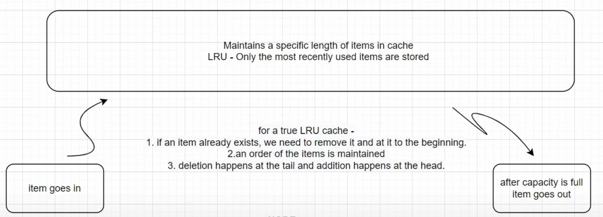
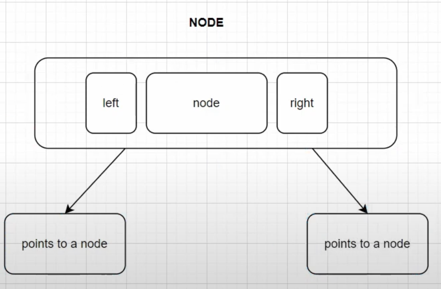
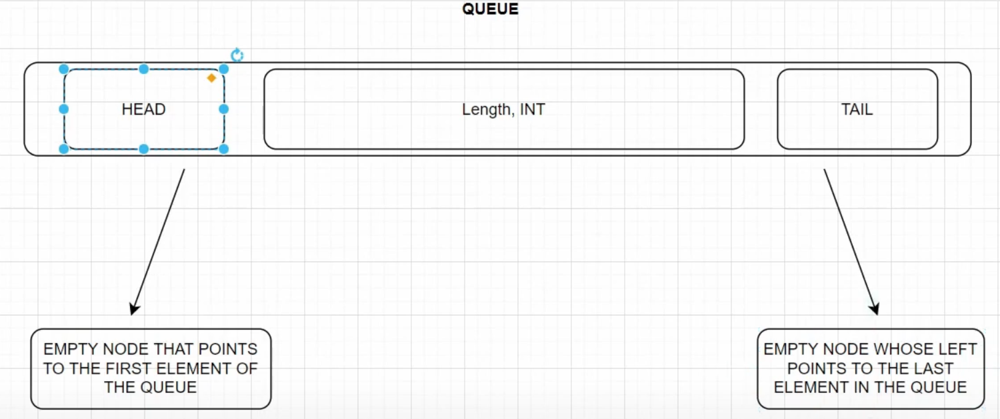
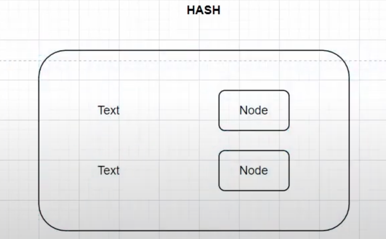

# LRU Cache

## Overview

Implementation of a LRU cache written in Go, utilizing a linked list.

As the name suggests when the cache memory is full, LRU picks the data that is least recently used and removes it in order to make space for the new data.

### Node
A node will contain a value as well as a pointer to its left and right element.

### Queue
The head and tail are empty nodes.

The item to the right of the head will point to the first element of the queue, and the item to the left of the tail will point to the last element of the queue.

### Hash
A map which stores a key value pair of the text and corresponding node.
